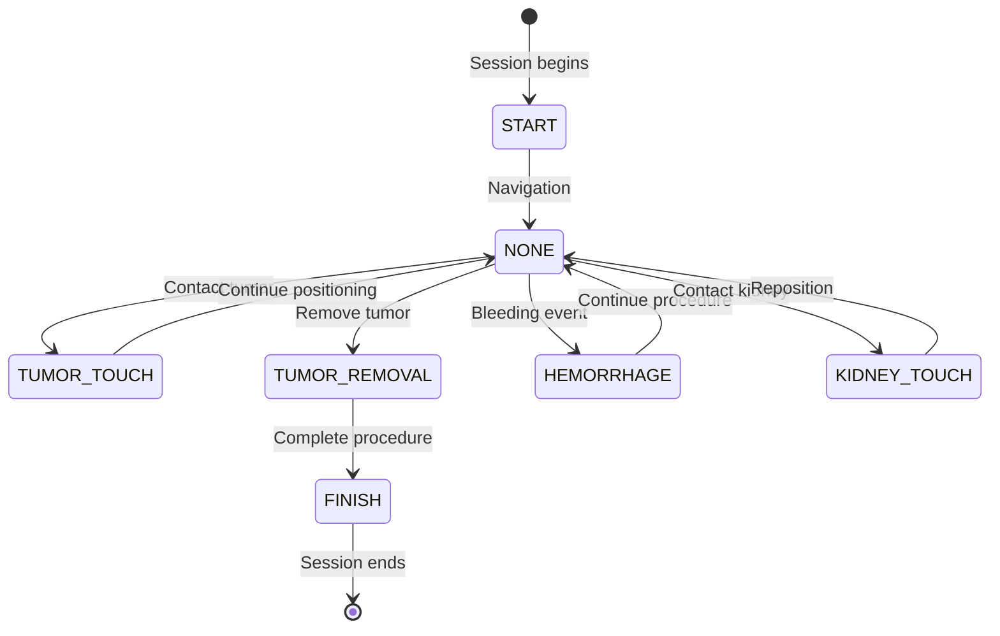

## Overview

`SurgeryEvent` is an enumeration that defines all possible surgical events that can occur during a simulated kidney surgery session. These events are captured in real-time telemetry data and used for performance analysis and training feedback.

## Event Types

<ResponseField name="NONE" type="enum">
  Default event indicating normal instrument movement with no specific surgical action.
  
  **Use Cases**:
  - Standard position updates during navigation
  - Instrument movement between anatomical targets
  - Idle state tracking
  
  **Frequency**: Most common event type, typically 80-90% of telemetry data
</ResponseField>

<ResponseField name="START" type="enum">
  Marks the beginning of a surgical simulation session.
  
  **Use Cases**:
  - Session initialization
  - Timer start trigger
  - Baseline position establishment
  
  **Occurrence**: First event in every surgery session
  
  **Notes**: Should be sent immediately when the surgeon begins the procedure
</ResponseField>

<ResponseField name="FINISH" type="enum">
  Marks the successful completion of a surgical simulation session.
  
  **Use Cases**:
  - Session termination
  - Duration calculation trigger
  - Final trajectory capture
  
  **Occurrence**: Final event in completed surgery sessions
  
  **Notes**: Triggers AI analysis and performance scoring
</ResponseField>

<ResponseField name="TUMOR_TOUCH" type="enum">
  Indicates the surgical instrument has made contact with tumor tissue.
  
  **Use Cases**:
  - Tumor localization verification
  - Precision assessment
  - Pre-removal event tracking
  
  **Significance**: Important for evaluating targeting accuracy and approach technique
  
  **Analysis Weight**: High - impacts precision score
</ResponseField>

<ResponseField name="TUMOR_REMOVAL" type="enum">
  Indicates successful removal of the tumor tissue.
  
  **Use Cases**:
  - Primary objective completion
  - Technique effectiveness validation
  - Success metric tracking
  
  **Significance**: Critical event representing achievement of primary surgical goal
  
  **Analysis Weight**: Very High - major factor in overall performance score
</ResponseField>

<ResponseField name="HEMORRHAGE" type="enum">
  Indicates a bleeding event has occurred during the procedure.
  
  **Use Cases**:
  - Complication tracking
  - Technique safety evaluation
  - Risk assessment
  
  **Significance**: Negative event indicating potential damage to blood vessels
  
  **Analysis Weight**: High Penalty - significantly impacts safety and performance scores
  
  **Training Focus**: Requires review of technique and instrument control
</ResponseField>

<ResponseField name="KIDNEY_TOUCH" type="enum">
  Indicates the surgical instrument has made contact with healthy kidney tissue.
  
  **Use Cases**:
  - Collateral damage tracking
  - Precision monitoring
  - Approach angle assessment
  
  **Significance**: Negative event indicating potential damage to healthy tissue
  
  **Analysis Weight**: Moderate Penalty - impacts precision and safety scores
  
  **Training Focus**: Suggests need for improved spatial awareness and approach trajectory
</ResponseField>

## Event Flow Diagram



## JSON Examples

### Session Start

```json
{
  "coordinates": [0.0, 0.0],
  "event": "START",
  "timestamp": 1709740800000
}
```

### Normal Navigation

```json
{
  "coordinates": [125.5, 340.2, 15.8],
  "event": "NONE",
  "timestamp": 1709740805000
}
```

### Tumor Contact

```json
{
  "coordinates": [145.3, 298.7, 22.1],
  "event": "TUMOR_TOUCH",
  "timestamp": 1709740810000
}
```

### Successful Tumor Removal

```json
{
  "coordinates": [145.3, 298.7, 22.1],
  "event": "TUMOR_REMOVAL",
  "timestamp": 1709740850000
}
```

### Complication: Hemorrhage

```json
{
  "coordinates": [138.2, 305.4, 19.5],
  "event": "HEMORRHAGE",
  "timestamp": 1709740825000
}
```

### Unintended Contact

```json
{
  "coordinates": [152.1, 285.6, 25.3],
  "event": "KIDNEY_TOUCH",
  "timestamp": 1709740815000
}
```

### Session Completion

```json
{
  "coordinates": [0.0, 0.0],
  "event": "FINISH",
  "timestamp": 1709744700000
}
```

## Event Statistics & Analysis

### Performance Impact Matrix

| Event | Score Impact | Weight | Notes |
|-------|--------------|--------|-------|
| START | Neutral | N/A | Required event |
| FINISH | Neutral | N/A | Required event |
| NONE | Neutral | 0 | Normal operation |
| TUMOR_TOUCH | Positive | +5 | Indicates good targeting |
| TUMOR_REMOVAL | Positive | +20 | Primary objective |
| HEMORRHAGE | Negative | -15 | Safety concern |
| KIDNEY_TOUCH | Negative | -8 | Precision issue |

### Typical Event Distribution

For a successful surgery with good technique:

- NONE: ~85-90%
- START: 1 occurrence
- FINISH: 1 occurrence
- TUMOR_TOUCH: 1-3 occurrences
- TUMOR_REMOVAL: 1 occurrence
- HEMORRHAGE: 0 occurrences (ideal)
- KIDNEY_TOUCH: 0-1 occurrences (acceptable)

## Usage in Code

### Telemetry Validation

```java
public record TelemetryDTO(
    @NotNull double[] coordinates,
    @NotNull SurgeryEvent event,  // Enum validation
    @Positive long timestamp
) {}
```

### Event Processing

```java
switch (telemetry.event()) {
    case START -> handleSessionStart();
    case FINISH -> handleSessionEnd();
    case TUMOR_REMOVAL -> recordSuccess();
    case HEMORRHAGE -> recordComplication();
    case KIDNEY_TOUCH -> recordContact();
    // ...
}
```

### Movement Recording

```java
Movement movement = new Movement(
    telemetry.coordinates(),
    telemetry.event(),
    telemetry.timestamp()
);
surgerySession.addMovement(movement);
```

## Related Models

- [TelemetryDTO](/api/models/telemetry) - Uses SurgeryEvent for real-time data
- [Movement](/api/models/trajectory#movement-structure) - Stores event with each movement
- [TrajectoryDTO](/api/models/trajectory) - Contains movements with events
- [AnalysisDTO](/api/models/analysis) - Evaluates events for performance scoring

## Best Practices

### For Frontend Developers

1. **Always send START event** when the session begins
2. **Send NONE for normal movements** to maintain complete trajectory
3. **Detect events accurately** using collision detection or sensor data
4. **Always send FINISH event** to trigger analysis
5. **Include precise timestamps** for accurate temporal analysis

### For Backend Developers

1. **Validate event transitions** (e.g., FINISH should follow START)
2. **Track event counts** for analysis and statistics
3. **Log critical events** (HEMORRHAGE, TUMOR_REMOVAL) for auditing
4. **Handle event sequences** logically in business rules

### For AI Analysis Integration

1. **Weight events appropriately** in scoring algorithms
2. **Consider event timing** (e.g., quick TUMOR_REMOVAL is positive)
3. **Detect event patterns** (multiple HEMORRHAGE events = poor technique)
4. **Provide event-specific feedback** in analysis results

## Source Location

`backend/src/main/java/project/Justina/domain/model/SurgeryEvent.java`