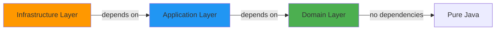
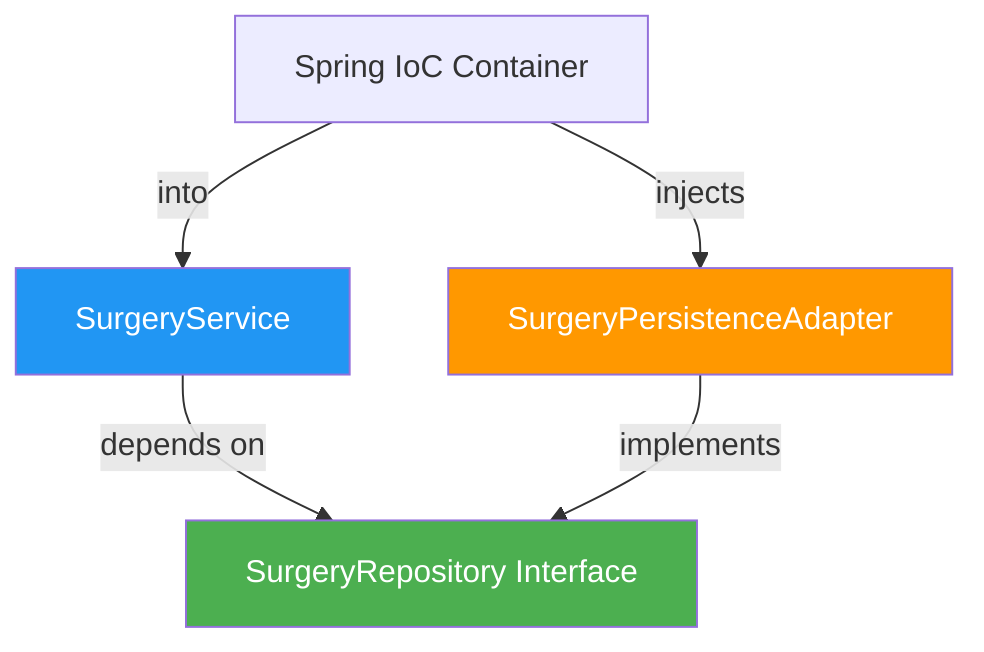

# Clean Architecture Implementation

Justina Core Backend implements **Hexagonal Architecture** (Ports and Adapters) with strict layer separation to achieve high maintainability, testability, and technology independence.

## The Three Layers

### Layer Hierarchy



<AccordionGroup>
  <Accordion title="Domain Layer - Core Business Logic" icon="gem">
    
**Location**: `src/main/java/project/Justina/domain/`

**Purpose**: Contains the **business rules** and **entities** that are framework-agnostic.

**Contents**:
- **Models** - Aggregate roots and value objects
- **Repository Interfaces** - Port definitions (contracts)
- **DTOs** - Data transfer objects for API boundaries
- **Exceptions** - Domain-specific errors

**Key Principle**: Zero dependencies on Spring, JPA, or any infrastructure framework.

```java
// domain/model/SurgerySession.java
public class SurgerySession {
    private UUID id;
    private UUID surgeonId;
    private List<Movement> trajectory;
    private LocalDateTime startTime;
    private LocalDateTime endTime;
    private Double score;
    private String feedback;
    
    public SurgerySession(UUID surgeonId) {
        this.id = UUID.randomUUID();
        this.surgeonId = surgeonId;
        this.trajectory = new ArrayList<>();
        this.startTime = LocalDateTime.now();
    }
    
    public void addMovement(Movement movement) {
        this.trajectory.add(movement);
    }
    
    public void endSurgery() {
        this.endTime = LocalDateTime.now();
        this.durationInSeconds = Duration.between(startTime, endTime).getSeconds();
    }
}
```

**Why it matters**: Domain models can be tested with pure unit tests, no mocking required.

  </Accordion>

  <Accordion title="Application Layer - Use Cases" icon="gear">
    
**Location**: `src/main/java/project/Justina/application/service/`

**Purpose**: Orchestrates business workflows using domain objects and port interfaces.

**Contents**:
- `AuthService.java` - Authentication use cases
- `SurgeryService.java` - Surgery management use cases

**Dependencies**: Only depends on domain layer (interfaces, models, DTOs)

```java
// application/service/SurgeryService.java
@Service
@RequiredArgsConstructor
public class SurgeryService {
    private final SurgeryRepository surgeryRepository; // Port interface
    
    public TrajectoryDTO getSurgeryTrajectory(UUID surgeryId, UUID surgeonId, String role) {
        SurgerySession session = surgeryRepository.findById(surgeryId)
            .orElseThrow(() -> new SurgeryNotFoundException("Surgery not found"));
        
        // Business rule: Only surgeon or AI can access
        if (!session.getSurgeonId().equals(surgeonId) && !"ROLE_AI".equals(role)) {
            throw new ForbiddenActionException("Access denied");
        }
        
        return new TrajectoryDTO(
            session.getId(),
            session.getStartTime(),
            session.getEndTime(),
            session.getTrajectory(),
            session.getScore(),
            session.getFeedback()
        );
    }
    
    public void saveAiAnalysis(UUID surgeryId, AnalysisDTO analysis) {
        SurgerySession session = surgeryRepository.findById(surgeryId)
            .orElseThrow(() -> new SurgeryNotFoundException("Surgery not found"));
        
        session.updateAnalysis(analysis.score(), analysis.feedback());
        surgeryRepository.save(session);
    }
}
```

**Key Features**:

Annotated with `@Service` (only Spring annotation). Uses constructor injection via `@RequiredArgsConstructor` (Lombok). Works with **interfaces**, not concrete implementations.

  </Accordion>

  <Accordion title="Infrastructure Layer - Technical Details" icon="server">
    
**Location**: `src/main/java/project/Justina/infrastructure/`

**Purpose**: Implements **adapters** for external systems (database, REST, WebSocket, security).

**Subdirectories**:
- `adapter/` - Persistence adapters and mappers
- `controller/` - REST API endpoints
- `security/` - JWT and Spring Security configuration
- `websocket/` - WebSocket handlers
- `config/` - Spring configuration classes

**Example - Persistence Adapter**:

```java
// infrastructure/adapter/SurgeryPersistenceAdapter.java
@Component
@RequiredArgsConstructor
public class SurgeryPersistenceAdapter implements SurgeryRepository {
    private final JpaSurgeryRepository jpaRepository; // Spring Data JPA
    private final SurgeryMapper mapper;
    
    @Override
    public void save(SurgerySession session) {
        SurgerySessionEntity entity = mapper.toEntity(session);
        jpaRepository.save(entity);
    }
    
    @Override
    public Optional<SurgerySession> findById(UUID id) {
        return jpaRepository.findById(id)
            .map(mapper::toDomain);
    }
}
```

**Mapping Logic**:

```java
// infrastructure/adapter/mapper/SurgeryMapper.java
@Component
public class SurgeryMapper {
    public SurgerySessionEntity toEntity(SurgerySession domain) {
        SurgerySessionEntity entity = new SurgerySessionEntity();
        entity.setId(domain.getId());
        entity.setSurgeonId(domain.getSurgeonId());
        entity.setTrajectory(domain.getTrajectory());
        entity.setStartTime(domain.getStartTime());
        entity.setEndTime(domain.getEndTime());
        entity.setScore(domain.getScore());
        entity.setFeedback(domain.getFeedback());
        return entity;
    }
    
    public SurgerySession toDomain(SurgerySessionEntity entity) {
        return new SurgerySession(
            entity.getId(),
            entity.getSurgeonId(),
            entity.getTrajectory(),
            entity.getStartTime(),
            entity.getEndTime(),
            entity.getDurationInSeconds(),
            entity.getScore(),
            entity.getFeedback()
        );
    }
}
```

**Why separate entities from models?**

JPA entities have framework annotations (`@Entity`, `@Table`, `@Column`). Domain models are pure POJOs with business logic. Changes to database schema don't affect domain layer.

  </Accordion>
</AccordionGroup>

## Ports and Adapters Pattern

### What are Ports?

**Ports** are interfaces defined in the **domain layer** that specify contracts for external systems.

```java
// domain/repository/SurgeryRepository.java (PORT)
public interface SurgeryRepository {
    void save(SurgerySession session);
    Optional<SurgerySession> findById(UUID id);
}
```

```java
// domain/repository/UserRepository.java (PORT)
public interface UserRepository {
    Optional<User> findByUsername(String username);
    void save(User user);
}
```

### What are Adapters?

**Adapters** are concrete implementations in the **infrastructure layer** that connect to external systems.

<CardGroup cols={2}>
  <Card title="Database Adapter" icon="database">
    `SurgeryPersistenceAdapter` implements `SurgeryRepository` using Spring Data JPA
  </Card>
  <Card title="REST Adapter" icon="plug">
    `SurgeryController` exposes domain services via HTTP endpoints
  </Card>
  <Card title="WebSocket Adapter" icon="comments">
    `SimulationWebSocketHandler` receives telemetry and calls domain services
  </Card>
  <Card title="Security Adapter" icon="key">
    `JwtService` generates/validates tokens for authentication
  </Card>
</CardGroup>

## Dependency Inversion Principle

The application layer depends on **abstractions** (repository interfaces), not **concrete implementations**.



**Benefits**:
- ✅ Services can be tested with mock repositories
- ✅ Database can be swapped (H2 → PostgreSQL) without changing service code
- ✅ Business logic is isolated from framework details

## Real-World Example: Authentication Flow

Let's trace a login request through all layers:

<Steps>
  <Step title="HTTP Request">
    **Infrastructure Layer**: `AuthController` receives POST `/api/v1/auth/login`
    
    ```java
    @PostMapping("/login")
    public ResponseEntity<AuthResponseDTO> login(@RequestBody LoginRequestDTO request) {
        AuthResponseDTO response = authService.login(
            request.username(), 
            request.password()
        );
        return ResponseEntity.ok(response);
    }
    ```
  </Step>
  
  <Step title="Use Case Execution">
    **Application Layer**: `AuthService` orchestrates the workflow
    
    ```java
    public AuthResponseDTO login(String username, String password) {
        // 1. Fetch user via port
        User user = userRepository.findByUsername(username)
            .orElseThrow(() -> new UsernameNotFoundException("User not found"));
        
        // 2. Validate password
        if (!passwordEncoder.matches(password, user.getPassword())) {
            throw new AuthException("Invalid credentials");
        }
        
        // 3. Generate token
        String token = jwtService.createToken(user.getId(), user.getUsername(), user.getRole());
        
        return new AuthResponseDTO(token, user.getId(), user.getUsername(), "Login successful");
    }
    ```
  </Step>
  
  <Step title="Repository Query">
    **Infrastructure Layer**: `UserPersistenceAdapter` queries database
    
    ```java
    public Optional<User> findByUsername(String username) {
        return jpaUserRepository.findByUsername(username)
            .map(userMapper::toDomain);
    }
    ```
  </Step>
  
  <Step title="Domain Validation">
    **Domain Layer**: `User` model holds the data, no framework dependencies
    
    ```java
    public class User {
        private UUID id;
        private String username;
        private String password; // BCrypt hash
        private String role;
    }
    ```
  </Step>
</Steps>

## Benefits of This Architecture

### 1. Testability

<Tabs>
  <Tab title="Unit Tests">
    Test domain models in isolation:
    
    ```java
    @Test
    void shouldCalculateSurgeryDuration() {
        SurgerySession session = new SurgerySession(UUID.randomUUID());
        session.addMovement(new Movement(new double[]{1,2,3}, SurgeryEvent.START, 0));
        Thread.sleep(1000);
        session.endSurgery();
        
        assertThat(session.getDurationInSeconds()).isGreaterThan(0);
    }
    ```
  </Tab>
  
  <Tab title="Integration Tests">
    Test services with mocked repositories:
    
    ```java
    @Test
    void shouldThrowExceptionWhenSurgeryNotFound() {
        when(surgeryRepository.findById(any())).thenReturn(Optional.empty());
        
        assertThatThrownBy(() -> 
            surgeryService.getSurgeryTrajectory(UUID.randomUUID(), UUID.randomUUID(), "ROLE_SURGEON")
        ).isInstanceOf(SurgeryNotFoundException.class);
    }
    ```
  </Tab>
  
  <Tab title="Controller Tests">
    Test endpoints with `@WebMvcTest`:
    
    ```java
    @WebMvcTest(SurgeryController.class)
    class SurgeryControllerTest {
        @MockBean
        private SurgeryService surgeryService;
        
        @Test
        void shouldReturnTrajectory() throws Exception {
            mockMvc.perform(get("/api/v1/surgeries/{id}/trajectory", uuid))
                .andExpect(status().isOk());
        }
    }
    ```
  </Tab>
</Tabs>

### 2. Maintainability

- **Framework migrations**: Switching from Spring to Quarkus only affects infrastructure layer
- **Database changes**: Switching from PostgreSQL to MongoDB requires rewriting adapters, not services
- **Business logic changes**: Domain rules update in one place (domain layer)

### 3. Technology Independence

The domain layer can be:
- Tested without Spring Boot
- Reused in different applications
- Understood by non-technical stakeholders (no framework noise)

## Common Pitfalls to Avoid

<Warning>
  **Don't let infrastructure leak into domain**
  
  ❌ Bad:
  ```java
  // domain/model/User.java
  @Entity // JPA annotation in domain!
  public class User {
      @Id @GeneratedValue
      private UUID id;
  }
  ```
  
  ✅ Good:
  ```java
  // domain/model/User.java
  public class User { // Pure POJO
      private UUID id;
  }
  
  // infrastructure/adapter/entity/UserEntity.java
  @Entity
  public class UserEntity {
      @Id @GeneratedValue
      private UUID id;
  }
  ```
</Warning>

<Warning>
  **Don't inject concrete implementations into services**
  
  ❌ Bad:
  ```java
  public class SurgeryService {
      private final SurgeryPersistenceAdapter adapter; // Concrete class!
  }
  ```
  
  ✅ Good:
  ```java
  public class SurgeryService {
      private final SurgeryRepository repository; // Interface!
  }
  ```
</Warning>

## Layer Communication Rules

| From Layer | Can Call | Cannot Call |
|------------|----------|-------------|
| Infrastructure | Application, Domain | - |
| Application | Domain | Infrastructure |
| Domain | - | Application, Infrastructure |

## Next Steps

<CardGroup cols={2}>
  <Card title="Design Patterns" icon="puzzle-piece" href="/architecture/design-patterns">
    Explore common patterns used in the codebase
  </Card>
  <Card title="WebSocket Architecture" icon="bolt" href="/websocket/overview">
    Learn about real-time communication patterns
  </Card>
  <Card title="Authentication" icon="shield" href="/authentication/jwt">
    Explore authentication and authorization
  </Card>
  <Card title="API Reference" icon="code" href="/api/auth/login">
    Browse the complete API documentation
  </Card>
  <Card title="WebSocket Architecture" icon="bolt" href="/features/websocket">
    Learn how real-time telemetry flows through the layers
  </Card>
  <Card title="Testing Strategy" icon="flask" href="/testing/overview">
    Understand how to test each layer effectively
  </Card>
  <Card title="Security Implementation" icon="shield" href="/security/jwt">
    See how JWT authentication fits into the architecture
  </Card>
</CardGroup>
