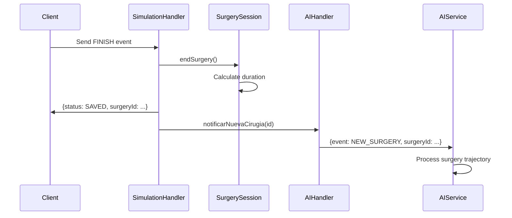
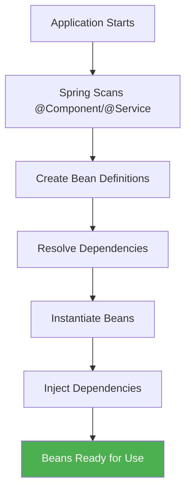

# Design Patterns

Justina Core Backend leverages proven design patterns to solve common architectural challenges in Spring Boot applications.

## Pattern Catalog

<CardGroup cols={3}>
  <Card title="Repository" icon="database">
    Abstraction over data access
  </Card>
  <Card title="DTO" icon="box">
    Data transfer between layers
  </Card>
  <Card title="Factory" icon="industry">
    Object creation logic
  </Card>
  <Card title="Strategy" icon="chess">
    Interchangeable algorithms
  </Card>
  <Card title="Observer" icon="eye">
    Event-driven notifications
  </Card>
  <Card title="Dependency Injection" icon="plug">
    Inversion of Control
  </Card>
</CardGroup>

---

## 1. Repository Pattern

### Purpose

Encapsulate data access logic behind interfaces, allowing the application layer to work with domain models without knowing persistence details.

### Implementation

<Steps>
  <Step title="Define Port Interface">
    **Location**: `domain/repository/SurgeryRepository.java`
    
    ```java
    public interface SurgeryRepository {
        void save(SurgerySession session);
        Optional<SurgerySession> findById(UUID id);
    }
    ```
    
    **Key Points**:
    - Lives in domain layer
    - Works with domain models (`SurgerySession`)
    - No framework dependencies
  </Step>
  
  <Step title="Implement Adapter">
    **Location**: `infrastructure/adapter/SurgeryPersistenceAdapter.java`
    
    ```java
    @Component
    @RequiredArgsConstructor
    public class SurgeryPersistenceAdapter implements SurgeryRepository {
        private final JpaSurgeryRepository jpaRepository;
        private final SurgeryMapper mapper;
        
        @Override
        public void save(SurgerySession session) {
            SurgerySessionEntity entity = mapper.toEntity(session);
            jpaRepository.save(entity);
        }
        
        @Override
        public Optional<SurgerySession> findById(UUID id) {
            return jpaRepository.findById(id)
                .map(mapper::toDomain);
        }
    }
    ```
    
    **Key Points**:
    - Uses Spring Data JPA internally
    - Converts between `SurgerySessionEntity` (JPA) and `SurgerySession` (domain)
    - Registered as Spring `@Component`
  </Step>
  
  <Step title="Inject into Service">
    **Location**: `application/service/SurgeryService.java`
    
    ```java
    @Service
    @RequiredArgsConstructor
    public class SurgeryService {
        private final SurgeryRepository surgeryRepository; // Interface, not implementation
        
        public TrajectoryDTO getSurgeryTrajectory(UUID surgeryId, UUID surgeonId, String role) {
            SurgerySession session = surgeryRepository.findById(surgeryId)
                .orElseThrow(() -> new SurgeryNotFoundException("Surgery not found"));
            // ...
        }
    }
    ```
  </Step>
</Steps>

### Benefits

<AccordionGroup>
  <Accordion title="Testability" icon="flask">
    Services can be tested with mock repositories:
    
    ```java
    @Mock
    private SurgeryRepository surgeryRepository;
    
    @InjectMocks
    private SurgeryService surgeryService;
    
    @Test
    void shouldThrowExceptionWhenNotFound() {
        when(surgeryRepository.findById(any())).thenReturn(Optional.empty());
        
        assertThatThrownBy(() -> surgeryService.getSurgeryTrajectory(uuid, uuid, "ROLE_SURGEON"))
            .isInstanceOf(SurgeryNotFoundException.class);
    }
    ```
  </Accordion>
  
  <Accordion title="Database Agnostic" icon="database">
    Switch from PostgreSQL to MongoDB by implementing a new adapter:
    
    ```java
    @Component
    public class MongoSurgeryAdapter implements SurgeryRepository {
        private final MongoTemplate mongoTemplate;
        // Same interface, different implementation
    }
    ```
  </Accordion>
  
  <Accordion title="Centralized Data Access" icon="layer-group">
    All database queries go through repository interfaces, making it easy to:
    - Add caching
    - Implement query logging
    - Apply security filters
  </Accordion>
</AccordionGroup>

### Related Files

- [`domain/repository/UserRepository.java`](~/workspace/source/backend/src/main/java/project/Justina/domain/repository/UserRepository.java)
- [`infrastructure/adapter/UserPersistenceAdapter.java`](~/workspace/source/backend/src/main/java/project/Justina/infrastructure/adapter/UserPersistenceAdapter.java)
- [`infrastructure/adapter/repository/JpaSurgeryRepository.java`](~/workspace/source/backend/src/main/java/project/Justina/infrastructure/adapter/repository/JpaSurgeryRepository.java)

---

## 2. Data Transfer Object (DTO) Pattern

### Purpose

Decouple external API contracts from internal domain models, providing:
- **Validation** at API boundaries
- **Serialization control** for JSON responses
- **API stability** even when domain models change

### Implementation

#### Input DTO (Request Validation)

**Location**: `domain/dto/TelemetryDTO.java`

```java
public record TelemetryDTO(
    @NotNull(message = "Coordinates are required")
    @NotEmpty(message = "Must have at least one coordinate")
    @Size(min = 2, max = 3, message = "Coordinates must have 2 or 3 values")
    double[] coordinates,
    
    @NotNull(message = "Event is required")
    SurgeryEvent event,
    
    @Positive(message = "Timestamp must be positive")
    long timestamp
) {}
```

**Usage in WebSocket Handler**:

```java
// infrastructure/websocket/SimulationWebSocketHandler.java
@Override
public void handleTextMessage(WebSocketSession session, TextMessage message) {
    TelemetryDTO dto = objectMapper.readValue(message.getPayload(), TelemetryDTO.class);
    
    // Validate DTO
    Set<ConstraintViolation<TelemetryDTO>> violations = validator.validate(dto);
    if (!violations.isEmpty()) {
        session.close(CloseStatus.BAD_DATA);
        return;
    }
    
    // Convert DTO to domain model
    Movement movement = new Movement(
        dto.coordinates(),
        dto.event(),
        dto.timestamp()
    );
}
```

#### Output DTO (Response Serialization)

**Location**: `domain/dto/TrajectoryDTO.java`

```java
public record TrajectoryDTO(
    UUID surgeryId,
    LocalDateTime startTime,
    LocalDateTime endTime,
    List<Movement> trajectory,
    Double score,
    String feedback
) {}
```

**Usage in Service**:

```java
// application/service/SurgeryService.java
public TrajectoryDTO getSurgeryTrajectory(UUID surgeryId, UUID surgeonId, String role) {
    SurgerySession session = surgeryRepository.findById(surgeryId)
        .orElseThrow(() -> new SurgeryNotFoundException("Surgery not found"));
    
    // Authorization check
    if (!session.getSurgeonId().equals(surgeonId) && !"ROLE_AI".equals(role)) {
        throw new ForbiddenActionException("Access denied");
    }
    
    // Map domain model to DTO
    return new TrajectoryDTO(
        session.getId(),
        session.getStartTime(),
        session.getEndTime(),
        session.getTrajectory(),
        session.getScore(),
        session.getFeedback()
    );
}
```

### Why Use DTOs?

<Tabs>
  <Tab title="Security">
    **Hide sensitive fields** from API responses:
    
    ```java
    // Domain model has password field
    public class User {
        private String password; // BCrypt hash
    }
    
    // DTO excludes password
    public record UserResponseDTO(
        UUID id,
        String username,
        String role
    ) {}
    ```
  </Tab>
  
  <Tab title="Validation">
    **Centralized input validation** with Jakarta Bean Validation:
    
    ```java
    public record LoginRequestDTO(
        @NotBlank(message = "Username is required")
        String username,
        
        @NotBlank(message = "Password is required")
        @Size(min = 8, message = "Password must be at least 8 characters")
        String password
    ) {}
    ```
  </Tab>
  
  <Tab title="API Stability">
    **Domain models can evolve** without breaking API contracts:
    
    ```java
    // Domain model changes
    public class SurgerySession {
        private List<Movement> trajectory;
        private List<Annotation> annotations; // NEW FIELD
    }
    
    // DTO stays the same
    public record TrajectoryDTO(
        UUID surgeryId,
        List<Movement> trajectory // No annotations field
    ) {}
    ```
  </Tab>
</Tabs>

### DTO Catalog

| DTO | Type | Purpose | Location |
|-----|------|---------|----------|
| `LoginRequestDTO` | Input | Authentication credentials | `domain/dto/LoginRequestDTO.java` |
| `AuthResponseDTO` | Output | JWT token + user info | `domain/dto/AuthResponseDTO.java` |
| `TelemetryDTO` | Input | WebSocket telemetry data | `domain/dto/TelemetryDTO.java` |
| `TrajectoryDTO` | Output | Surgery trajectory for AI | `domain/dto/TrajectoryDTO.java` |
| `AnalysisDTO` | Input | AI analysis results | `domain/dto/AnalysisDTO.java` |
| `UserResponseDTO` | Output | User profile data | `domain/dto/UserResponseDTO.java` |

---

## 3. Factory Pattern

### Purpose

Encapsulate object creation logic, especially when construction is complex or requires external dependencies.

### Implementation: ObjectMapper Factory

**Location**: `infrastructure/websocket/WebSocketConfig.java`

```java
@Configuration
public class WebSocketConfig implements WebSocketConfigurer {
    
    @Bean
    public ObjectMapper objectMapper() {
        ObjectMapper mapper = new ObjectMapper();
        mapper.registerModule(new JavaTimeModule());
        mapper.disable(SerializationFeature.WRITE_DATES_AS_TIMESTAMPS);
        return mapper;
    }
}
```

**Usage**:

```java
@Component
@RequiredArgsConstructor
public class SimulationWebSocketHandler extends TextWebSocketHandler {
    private final ObjectMapper objectMapper; // Injected by Spring
    
    public void handleTextMessage(WebSocketSession session, TextMessage message) {
        TelemetryDTO dto = objectMapper.readValue(message.getPayload(), TelemetryDTO.class);
    }
}
```

### Implementation: PasswordEncoder Factory

**Location**: `infrastructure/security/ApplicationConfig.java`

```java
@Configuration
public class ApplicationConfig {
    
    @Bean
    public PasswordEncoder passwordEncoder() {
        return new BCryptPasswordEncoder();
    }
}
```

**Benefits**:
- Centralized configuration (BCrypt strength can be changed in one place)
- Easy to mock in tests
- Can switch to different algorithms (Argon2, PBKDF2) without changing service code

---

## 4. Strategy Pattern

### Purpose

Define a family of algorithms, encapsulate each one, and make them interchangeable at runtime.

### Implementation: JWT Authentication Strategies

**Location**: `infrastructure/security/JwtService.java`

```java
@Service
public class JwtService {
    @Value("${jwt.secret.key}")
    private String secretKey;
    
    public String createToken(UUID userId, String username, String role) {
        Algorithm algorithm = Algorithm.HMAC256(secretKey); // Strategy: HS256
        
        return JWT.create()
            .withIssuer("Justina_Backend")
            .withSubject(username)
            .withClaim("userId", userId.toString())
            .withClaim("role", role)
            .withIssuedAt(new Date())
            .withExpiresAt(new Date(System.currentTimeMillis() + 86400000))
            .sign(algorithm);
    }
}
```

**Strategy Swap Example**:

```java
// Current: HS256 (symmetric)
Algorithm algorithm = Algorithm.HMAC256(secretKey);

// Future: RS256 (asymmetric)
Algorithm algorithm = Algorithm.RSA256(publicKey, privateKey);
```

### Implementation: WebSocket Security Strategies

**Location**: `infrastructure/websocket/HandshakeInterceptorImpl.java`

```java
@Component
public class HandshakeInterceptorImpl implements HandshakeInterceptor {
    private final JwtService jwtService;
    
    @Override
    public boolean beforeHandshake(ServerHttpRequest request, /* ... */) {
        String token = extractTokenFromQuery(request);
        
        if (token != null && jwtService.isTokenValid(token)) {
            UUID surgeonId = jwtService.extractUserId(token);
            attributes.put("SURGEON_ID", surgeonId);
            return true;
        }
        
        return false;
    }
}
```

**Multiple Authentication Strategies**:
- **REST API**: JWT from `Authorization: Bearer <token>` header
- **WebSocket**: JWT from query parameter `?token=<token>`
- **Cookie**: JWT from HttpOnly cookie (for browser clients)

---

## 5. Observer Pattern

### Purpose

Define a one-to-many dependency where changes in one object trigger notifications to multiple observers.

### Implementation: WebSocket Session Management

**Location**: `infrastructure/websocket/SimulationWebSocketHandler.java`

```java
@Component
@RequiredArgsConstructor
public class SimulationWebSocketHandler extends TextWebSocketHandler {
    private final Map<String, SurgerySession> activeSessions = new ConcurrentHashMap<>();
    private final SurgeryRepository surgeryRepository;
    
    @Override
    public void handleTextMessage(WebSocketSession session, TextMessage message) {
        TelemetryDTO dto = objectMapper.readValue(message.getPayload(), TelemetryDTO.class);
        
        Movement movement = new Movement(
            dto.coordinates(),
            dto.event(),
            dto.timestamp()
        );
        
        UUID surgeonId = (UUID) session.getAttributes().get("SURGEON_ID");
        
        // Get or create surgery session
        SurgerySession surgery = activeSessions.computeIfAbsent(
            session.getId(), 
            k -> new SurgerySession(surgeonId)
        );
        
        surgery.addMovement(movement);
        
        // Notify observers on FINISH event
        if (movement.event() == SurgeryEvent.FINISH) {
            surgery.endSurgery();
            surgeryRepository.save(surgery);
            activeSessions.remove(session.getId());
            
            // Send response to client (Observer 1)
            String response = String.format(
                "{\"status\":\"SAVED\", \"surgeryId\":\"%s\"}", 
                surgery.getId()
            );
            session.sendMessage(new TextMessage(response));
            
            // Notify AI system (Observer 2)
            AIWebSocketHandler.notificarNuevaCirugia(surgery.getId());
        }
    }
}
```

### AI Notification System

**Location**: `infrastructure/websocket/AIWebSocketHandler.java`

```java
@Component
public class AIWebSocketHandler extends TextWebSocketHandler {
    private static final Set<WebSocketSession> aiSessions = ConcurrentHashMap.newKeySet();
    
    @Override
    public void afterConnectionEstablished(WebSocketSession session) {
        aiSessions.add(session); // Subscribe AI service
    }
    
    public static void notificarNuevaCirugia(UUID surgeryId) {
        String notification = String.format(
            "{\"event\":\"NEW_SURGERY\", \"surgeryId\":\"%s\"}", 
            surgeryId
        );
        
        // Broadcast to all AI observers
        aiSessions.forEach(session -> {
            try {
                session.sendMessage(new TextMessage(notification));
            } catch (IOException e) {
                aiSessions.remove(session);
            }
        });
    }
}
```

### Observer Flow



---

## 6. Dependency Injection (IoC)

### Purpose

Invert control of object creation from the application to a container (Spring IoC), enabling loose coupling and testability.

### Implementation: Constructor Injection

**Location**: `application/service/AuthService.java`

```java
@Service
@RequiredArgsConstructor // Lombok generates constructor
public class AuthService {
    private final UserRepository userRepository;
    private final JwtService jwtService;
    private final PasswordEncoder passwordEncoder;
    
    public AuthResponseDTO login(String username, String password) {
        User user = userRepository.findByUsername(username)
            .orElseThrow(() -> new UsernameNotFoundException("User not found"));
        
        if (!passwordEncoder.matches(password, user.getPassword())) {
            throw new AuthException("Invalid credentials");
        }
        
        String token = jwtService.createToken(user.getId(), user.getUsername(), user.getRole());
        
        return new AuthResponseDTO(token, user.getId(), user.getUsername(), "Login successful");
    }
}
```

**Why Constructor Injection?**

<Tabs>
  <Tab title="Immutability">
    Dependencies are `final`, ensuring they can't be changed after construction:
    
    ```java
    private final UserRepository userRepository; // Cannot be reassigned
    ```
  </Tab>
  
  <Tab title="Testability">
    Easy to mock dependencies in tests:
    
    ```java
    @Mock
    private UserRepository userRepository;
    
    @Mock
    private JwtService jwtService;
    
    @Mock
    private PasswordEncoder passwordEncoder;
    
    @InjectMocks
    private AuthService authService; // Automatically injects mocks
    ```
  </Tab>
  
  <Tab title="Required Dependencies">
    Constructor injection makes dependencies explicit and mandatory:
    
    ```java
    // Compile error if dependencies are missing
    AuthService service = new AuthService(userRepo, jwtService, passwordEncoder);
    ```
  </Tab>
</Tabs>

### Spring Bean Lifecycle



---

## Pattern Integration Example

Here's how multiple patterns work together in a typical request flow:

<Steps>
  <Step title="Client Sends Request">
    POST `/api/v1/surgeries/{id}/analysis` with `AnalysisDTO`
  </Step>
  
  <Step title="Controller Uses DTO Pattern">
    ```java
    @PostMapping("/{id}/analysis")
    public ResponseEntity<Void> saveAnalysis(
        @PathVariable UUID id,
        @RequestBody @Valid AnalysisDTO analysis // DTO Pattern
    ) {
        surgeryService.saveAiAnalysis(id, analysis); // Dependency Injection
        return ResponseEntity.noContent().build();
    }
    ```
  </Step>
  
  <Step title="Service Uses Repository Pattern">
    ```java
    public void saveAiAnalysis(UUID surgeryId, AnalysisDTO analysis) {
        SurgerySession session = surgeryRepository.findById(surgeryId) // Repository Pattern
            .orElseThrow(() -> new SurgeryNotFoundException("Surgery not found"));
        
        session.updateAnalysis(analysis.score(), analysis.feedback());
        surgeryRepository.save(session); // Repository Pattern
    }
    ```
  </Step>
  
  <Step title="Adapter Uses Mapper (Factory-like)">
    ```java
    public void save(SurgerySession session) {
        SurgerySessionEntity entity = mapper.toEntity(session); // Mapper Pattern
        jpaRepository.save(entity);
    }
    ```
  </Step>
</Steps>

---

## Best Practices

<CardGroup cols={2}>
  <Card title="Use Interfaces" icon="plug">
    Always program to interfaces, not implementations (Repository pattern)
  </Card>
  <Card title="Validate at Boundaries" icon="shield">
    Use DTOs with Bean Validation for all external inputs
  </Card>
  <Card title="Constructor Injection" icon="syringe">
    Prefer constructor injection over field injection for immutability
  </Card>
  <Card title="Single Responsibility" icon="bullseye">
    Each class should have one reason to change
  </Card>
</CardGroup>

<Warning>
  **Avoid Anti-Patterns**
  
  - Don't use `@Autowired` on fields (use constructor injection)
  - Don't create domain objects with `new` in services (use factories/repositories)
  - Don't return domain models directly from controllers (use DTOs)
  - Don't inject concrete classes when interfaces exist
</Warning>

## Further Reading

<CardGroup cols={2}>
  <Card title="Clean Architecture" icon="layer-group" href="/architecture/clean-architecture">
    See how patterns fit into the layered architecture
  </Card>
  <Card title="WebSocket Implementation" icon="comments" href="/websocket/overview">
    Deep dive into Observer pattern for real-time telemetry
  </Card>
  <Card title="Security Patterns" icon="lock" href="/authentication/jwt">
    Learn about Strategy pattern in authentication
  </Card>
  <Card title="Testing Patterns" icon="flask" href="/architecture/overview">
    Use mocks to test patterns in isolation
  </Card>
</CardGroup>
