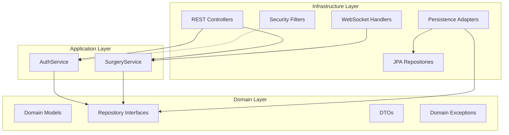

# Architecture Overview

Justina Core Backend is a **Spring Boot surgical simulation platform** built with clean architecture principles, designed for real-time telemetry collection, trajectory tracking, and AI-powered analysis of surgical procedures.

## Core Technologies

<CardGroup cols={2}>
  <Card title="Spring Boot 4.0.2" icon="leaf">
    Modern Java framework with dependency injection and auto-configuration
  </Card>
  <Card title="Java 21" icon="coffee">
    Latest LTS version with records, pattern matching, and virtual threads
  </Card>
  <Card title="Spring Data JPA" icon="database">
    ORM layer with Hibernate for PostgreSQL/H2 persistence
  </Card>
  <Card title="Spring Security + JWT" icon="shield">
    Role-based access control with stateless authentication
  </Card>
  <Card title="WebSocket (STOMP)" icon="bolt">
    Real-time bidirectional communication for telemetry streaming
  </Card>
  <Card title="SpringDoc OpenAPI" icon="book">
    Interactive API documentation with Swagger UI
  </Card>
</CardGroup>

## Architectural Style

The backend follows **Hexagonal Architecture** (Ports and Adapters) combined with **Clean Architecture** principles:



## Key Features

### 1. Real-Time Telemetry Streaming

- **WebSocket endpoints** for continuous data flow from surgical simulations
- **Observer pattern** implementation for session management
- **Validation pipeline** with Jakarta Bean Validation
- Bidirectional communication between Unity client and backend

<CodeGroup>
```java SimulationWebSocketHandler.java
@Override
public void handleTextMessage(WebSocketSession session, TextMessage message) {
    TelemetryDTO dto = objectMapper.readValue(message.getPayload(), TelemetryDTO.class);
    
    Movement movement = new Movement(
        dto.coordinates(),
        dto.event(),
        dto.timestamp()
    );
    
    SurgerySession surgery = activeSessions.computeIfAbsent(
        session.getId(), 
        k -> new SurgerySession(surgeonId)
    );
    
    surgery.addMovement(movement);
}
```
</CodeGroup>

### 2. JWT-Based Authentication

- **Stateless authentication** with HS256 signing algorithm
- **Role-based access control** (RBAC): `ROLE_SURGEON`, `ROLE_AI`
- **HttpOnly cookies** + Authorization header support
- Token expiration: 24 hours

See [`JwtService.java`](~/workspace/source/backend/src/main/java/project/Justina/infrastructure/security/JwtService.java:20) for implementation.

### 3. AI Integration Pipeline

1. **Surgery Completion** → Backend saves session
2. **AI Notification** → WebSocket broadcast to AI service
3. **Trajectory Retrieval** → AI fetches movement data via REST
4. **Analysis Upload** → AI posts scores/feedback
5. **Data Persistence** → Results stored with surgery session

<Steps>
  <Step title="Surgery Ends">
    Client sends `FINISH` event via WebSocket
  </Step>
  <Step title="Data Persisted">
    Backend saves trajectory to database
  </Step>
  <Step title="AI Notified">
    System broadcasts `NEW_SURGERY` event
  </Step>
  <Step title="AI Analysis">
    AI service processes 5-step analysis pipeline
  </Step>
  <Step title="Results Saved">
    POST `/api/v1/surgeries/{id}/analysis` with score/feedback
  </Step>
</Steps>

## Project Structure

The codebase is organized into three main layers:

```bash
src/main/java/project/Justina/
├── application/          # Application Services
│   └── service/
│       ├── AuthService.java
│       └── SurgeryService.java
├── domain/              # Business Logic Core
│   ├── model/          # Entities: User, SurgerySession, Movement
│   ├── dto/            # Data Transfer Objects
│   ├── repository/     # Port Interfaces
│   └── exception/      # Domain Exceptions
└── infrastructure/      # External Adapters
    ├── adapter/        # Persistence implementations
    ├── controller/     # REST endpoints
    ├── security/       # JWT + Spring Security
    ├── websocket/      # WebSocket handlers
    └── config/         # Spring configuration
```

<Accordion title="View Detailed File Breakdown">
  
**Domain Layer** (`domain/`):
- `model/User.java` - User aggregate with roles
- `model/SurgerySession.java` - Surgery aggregate root
- `model/Movement.java` - Value object for telemetry
- `model/SurgeryEvent.java` - Enum for event types
- `repository/UserRepository.java` - Port interface
- `repository/SurgeryRepository.java` - Port interface
- `dto/TelemetryDTO.java` - Input validation
- `dto/TrajectoryDTO.java` - Output serialization
- `exception/AuthException.java` - Domain error

**Application Layer** (`application/service/`):
- `AuthService.java` - Authentication orchestration
- `SurgeryService.java` - Surgery business logic

**Infrastructure Layer** (`infrastructure/`):
- `adapter/SurgeryPersistenceAdapter.java` - Repository implementation
- `adapter/mapper/SurgeryMapper.java` - Entity-Domain mapping
- `controller/AuthController.java` - REST endpoints
- `controller/SurgeryController.java` - Surgery API
- `security/JwtService.java` - Token generation
- `security/JwtAuthenticationFilter.java` - Request interceptor
- `websocket/SimulationWebSocketHandler.java` - Telemetry handler
- `websocket/AIWebSocketHandler.java` - AI notification channel

</Accordion>

## Design Principles

### Dependency Rule

<Warning>
  **Dependencies flow inward**: Infrastructure → Application → Domain
  
  The domain layer has **zero external dependencies** and contains pure business logic.
</Warning>

### Separation of Concerns

| Layer | Responsibility | Examples |
|-------|----------------|----------|
| **Domain** | Business rules, entities, value objects | `SurgerySession`, `Movement`, `User` |
| **Application** | Use cases, orchestration | `AuthService.login()`, `SurgeryService.saveAiAnalysis()` |
| **Infrastructure** | Technical details, frameworks | Controllers, JPA, WebSocket handlers |

### Testability

- **Unit tests** for domain logic (no mocking needed)
- **Integration tests** for services (mock repositories)
- **Controller tests** with `@WebMvcTest`
- **WebSocket tests** with `StompSession`

See the [Testing Guide](/testing/overview) for details.

## Next Steps

<CardGroup cols={2}>
  <Card title="Clean Architecture Deep Dive" icon="layer-group" href="/architecture/clean-architecture">
    Explore the three-layer separation in detail
  </Card>
  <Card title="Design Patterns" icon="puzzle-piece" href="/architecture/design-patterns">
    Learn about Repository, DTO, Strategy, and Observer patterns
  </Card>
  <Card title="API Reference" icon="code" href="/api/auth/login">
    Browse REST endpoints and WebSocket protocols
  </Card>
  <Card title="Security Architecture" icon="lock" href="/authentication/overview">
    Understand JWT flow and RBAC implementation
  </Card>
</CardGroup>
