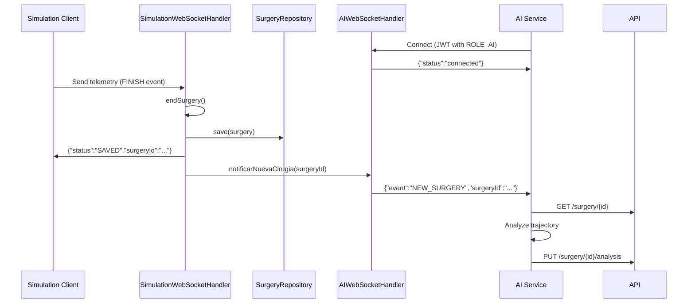

## Overview

The AI WebSocket endpoint (`/ws/ai`) enables AI analysis services to receive real-time notifications when new surgery sessions are completed and ready for analysis. This decouples the simulation system from AI processing, allowing asynchronous analysis workflows.

## Connection URL

```
ws://localhost:8080/ws/ai?token=<JWT_TOKEN>
```

**Authentication:** Required (JWT token with `ROLE_AI`)  
**Protocol:** WebSocket (Text frames)  
**Handler:** `AIWebSocketHandler`  
**Direction:** Server-to-client (notifications)

## Authentication

Only clients with the `ROLE_AI` role can connect to this endpoint.

### Connection Establishment

```java
@Override
public void afterConnectionEstablished(WebSocketSession session) throws Exception {
    String role = (String) session.getAttributes().get("ROLE");

    if (role != null && role.equals("ROLE_AI")) {
        aiSessions.put(session.getId(), session);
        System.out.println("🤖 IA conectada: " + session.getId());

        session.sendMessage(new TextMessage(
            "{\"status\":\"connected\",\"message\":\"IA conectada exitosamente\"}"
        ));
    } else {
        session.close(CloseStatus.POLICY_VIOLATION);
    }
}
```

**Source:** `backend/src/main/java/project/Justina/infrastructure/websocket/AIWebSocketHandler.java:22-36`

**Authentication Flow:**
1. JWT token is validated by `HandshakeInterceptorImpl`
2. User role is extracted and stored in session attributes
3. Handler checks for `ROLE_AI` role
4. Non-AI connections are rejected with `POLICY_VIOLATION` (1008)
5. Valid connections receive a confirmation message

## Session Management

The handler maintains a concurrent map of all connected AI clients:

```java
private static final ConcurrentHashMap<String, WebSocketSession> aiSessions = new ConcurrentHashMap<>();
```

**Source:** `backend/src/main/java/project/Justina/infrastructure/websocket/AIWebSocketHandler.java:20`

### Why Static?

The `aiSessions` map is static to enable notification from other parts of the application, specifically from `SimulationWebSocketHandler` when surgeries complete.

### Connection Lifecycle

```java
@Override
public void afterConnectionClosed(WebSocketSession session, CloseStatus status) throws Exception {
    aiSessions.remove(session.getId());
    System.out.println("🤖 IA desconectada: " + session.getId());
}
```

**Source:** `backend/src/main/java/project/Justina/infrastructure/websocket/AIWebSocketHandler.java:45-48`

## Notification System

### Trigger Point

AI notifications are triggered when a surgery session finishes:

```java
if (movement.event() == SurgeryEvent.FINISH) {
    surgery.endSurgery();
    surgeryRepository.save(surgery);
    activeSessions.remove(session.getId());

    String response = String.format(
        "{\"status\":\"SAVED\", \"surgeryId\":\"%s\"}",
        surgery.getId()
    );
    session.sendMessage(new TextMessage(response));
    AIWebSocketHandler.notificarNuevaCirugia(surgery.getId());
}
```

**Source:** `backend/src/main/java/project/Justina/infrastructure/websocket/SimulationWebSocketHandler.java:74-82`

### Notification Implementation

The `notificarNuevaCirugia` method broadcasts to all connected AI clients:

```java
public static void notificarNuevaCirugia(UUID surgeryId) {
    aiSessions.values().forEach(session -> {
        try {
            String mensaje = String.format(
                "{\"event\":\"NEW_SURGERY\",\"surgeryId\":\"%s\"}",
                surgeryId
            );
            session.sendMessage(new TextMessage(mensaje));
            System.out.println("🔔 Notificación enviada a IA: " + surgeryId);
        } catch (Exception e) {
            System.err.println("❌ Error notificando a IA: " + e.getMessage());
        }
    });
}
```

**Source:** `backend/src/main/java/project/Justina/infrastructure/websocket/AIWebSocketHandler.java:51-64`

**Broadcast Behavior:**
- All connected AI clients receive the notification
- Failures are logged but don't interrupt other notifications
- Non-blocking broadcast (fire-and-forget pattern)

## Message Formats

### Connection Confirmation

Sent immediately after successful connection:

```json
{
  "status": "connected",
  "message": "IA conectada exitosamente"
}
```

### New Surgery Notification

Sent when a surgery session completes:

```json
{
  "event": "NEW_SURGERY",
  "surgeryId": "550e8400-e29b-41d4-a716-446655440000"
}
```

**Fields:**
- `event`: Always `"NEW_SURGERY"` for surgery completion notifications
- `surgeryId`: UUID of the completed surgery session (as string)

## Client Implementation

### Python AI Service Example

```python
import websocket
import json
import requests
from typing import Dict

class AIAnalysisService:
    def __init__(self, token: str, api_base_url: str):
        self.token = token
        self.api_base_url = api_base_url
        self.ws_url = f"ws://localhost:8080/ws/ai?token={token}"
        self.ws = None

    def on_open(self, ws):
        print("AI service connected to notification stream")

    def on_message(self, ws, message):
        data = json.loads(message)
        
        if data.get('status') == 'connected':
            print(f"Connection confirmed: {data['message']}")
            return
        
        if data.get('event') == 'NEW_SURGERY':
            surgery_id = data['surgeryId']
            print(f"New surgery received: {surgery_id}")
            self.analyze_surgery(surgery_id)

    def on_error(self, ws, error):
        print(f"WebSocket error: {error}")

    def on_close(self, ws, close_status_code, close_msg):
        if close_status_code == 1008:
            print("Connection closed: Invalid authentication (not ROLE_AI)")
        else:
            print(f"Connection closed: {close_status_code} - {close_msg}")

    def analyze_surgery(self, surgery_id: str):
        """Fetch surgery data and perform analysis"""
        try:
            # Fetch surgery data
            response = requests.get(
                f"{self.api_base_url}/api/v1/surgery/{surgery_id}",
                headers={"Authorization": f"Bearer {self.token}"}
            )
            surgery_data = response.json()
            
            # Perform AI analysis
            score, feedback = self.run_analysis(surgery_data)
            
            # Submit results back to API
            self.submit_analysis(surgery_id, score, feedback)
            
        except Exception as e:
            print(f"Error analyzing surgery {surgery_id}: {e}")

    def run_analysis(self, surgery_data: Dict) -> tuple[float, str]:
        """Implement your AI analysis logic here"""
        trajectory = surgery_data['trajectory']
        
        # Example: Count critical events
        tumor_touches = sum(1 for m in trajectory if m['event'] == 'TUMOR_TOUCH')
        hemorrhages = sum(1 for m in trajectory if m['event'] == 'HEMORRHAGE')
        
        # Calculate score (0-100)
        score = 100.0 - (hemorrhages * 10) - (tumor_touches * 2)
        score = max(0, min(100, score))
        
        # Generate feedback
        feedback = f"Performance: {score}/100. "
        if hemorrhages > 0:
            feedback += f"Caution: {hemorrhages} hemorrhage event(s) detected. "
        if tumor_touches > 5:
            feedback += f"Multiple tumor contacts ({tumor_touches}) - refine precision."
        
        return score, feedback

    def submit_analysis(self, surgery_id: str, score: float, feedback: str):
        """Submit analysis results via REST API"""
        response = requests.put(
            f"{self.api_base_url}/api/v1/surgery/{surgery_id}/analysis",
            headers={
                "Authorization": f"Bearer {self.token}",
                "Content-Type": "application/json"
            },
            json={
                "score": score,
                "feedback": feedback
            }
        )
        
        if response.status_code == 200:
            print(f"Analysis submitted for surgery {surgery_id}")
        else:
            print(f"Failed to submit analysis: {response.status_code}")

    def run(self):
        """Start the AI service"""
        self.ws = websocket.WebSocketApp(
            self.ws_url,
            on_open=self.on_open,
            on_message=self.on_message,
            on_error=self.on_error,
            on_close=self.on_close
        )
        
        print("Starting AI analysis service...")
        self.ws.run_forever()

# Usage
if __name__ == "__main__":
    AI_TOKEN = "your_ai_jwt_token_with_ROLE_AI"
    API_BASE = "http://localhost:8080"
    
    service = AIAnalysisService(AI_TOKEN, API_BASE)
    service.run()
```

### Node.js AI Service Example

```javascript
const WebSocket = require('ws');
const axios = require('axios');

class AIAnalysisService {
    constructor(token, apiBaseUrl) {
        this.token = token;
        this.apiBaseUrl = apiBaseUrl;
        this.wsUrl = `ws://localhost:8080/ws/ai?token=${token}`;
    }

    connect() {
        this.ws = new WebSocket(this.wsUrl);

        this.ws.on('open', () => {
            console.log('AI service connected to notification stream');
        });

        this.ws.on('message', async (data) => {
            const message = JSON.parse(data);

            if (message.status === 'connected') {
                console.log(`Connection confirmed: ${message.message}`);
                return;
            }

            if (message.event === 'NEW_SURGERY') {
                const surgeryId = message.surgeryId;
                console.log(`New surgery received: ${surgeryId}`);
                await this.analyzeSurgery(surgeryId);
            }
        });

        this.ws.on('error', (error) => {
            console.error('WebSocket error:', error);
        });

        this.ws.on('close', (code, reason) => {
            if (code === 1008) {
                console.error('Connection closed: Invalid authentication');
            } else {
                console.log(`Connection closed: ${code} - ${reason}`);
            }
        });
    }

    async analyzeSurgery(surgeryId) {
        try {
            // Fetch surgery data
            const response = await axios.get(
                `${this.apiBaseUrl}/api/v1/surgery/${surgeryId}`,
                {
                    headers: { Authorization: `Bearer ${this.token}` }
                }
            );

            const surgeryData = response.data;

            // Perform analysis
            const { score, feedback } = this.runAnalysis(surgeryData);

            // Submit results
            await this.submitAnalysis(surgeryId, score, feedback);

        } catch (error) {
            console.error(`Error analyzing surgery ${surgeryId}:`, error.message);
        }
    }

    runAnalysis(surgeryData) {
        const trajectory = surgeryData.trajectory;

        // Count critical events
        const tumorTouches = trajectory.filter(m => m.event === 'TUMOR_TOUCH').length;
        const hemorrhages = trajectory.filter(m => m.event === 'HEMORRHAGE').length;

        // Calculate score
        let score = 100 - (hemorrhages * 10) - (tumorTouches * 2);
        score = Math.max(0, Math.min(100, score));

        // Generate feedback
        let feedback = `Performance: ${score}/100. `;
        if (hemorrhages > 0) {
            feedback += `Caution: ${hemorrhages} hemorrhage event(s) detected. `;
        }
        if (tumorTouches > 5) {
            feedback += `Multiple tumor contacts (${tumorTouches}) - refine precision.`;
        }

        return { score, feedback };
    }

    async submitAnalysis(surgeryId, score, feedback) {
        try {
            await axios.put(
                `${this.apiBaseUrl}/api/v1/surgery/${surgeryId}/analysis`,
                { score, feedback },
                {
                    headers: {
                        Authorization: `Bearer ${this.token}`,
                        'Content-Type': 'application/json'
                    }
                }
            );
            console.log(`Analysis submitted for surgery ${surgeryId}`);
        } catch (error) {
            console.error(`Failed to submit analysis: ${error.message}`);
        }
    }
}

// Usage
const AI_TOKEN = 'your_ai_jwt_token_with_ROLE_AI';
const API_BASE = 'http://localhost:8080';

const service = new AIAnalysisService(AI_TOKEN, API_BASE);
service.connect();
```

## Integration Architecture



## Message Handling

The handler currently logs incoming messages but does not process them:

```java
@Override
protected void handleTextMessage(WebSocketSession session, TextMessage message) throws Exception {
    System.out.println("📩 Mensaje de IA: " + message.getPayload());
}
```

**Source:** `backend/src/main/java/project/Justina/infrastructure/websocket/AIWebSocketHandler.java:39-42`

**Future Enhancement:** This could be extended to support bidirectional communication, such as:
- AI service status updates
- Analysis progress notifications
- Request for specific surgery data

## Best Practices

### Resilient Connection Management

```python
import time
from websocket import WebSocketApp

class ResilientAIService:
    def __init__(self, token):
        self.token = token
        self.should_run = True
        
    def run_with_reconnect(self):
        while self.should_run:
            try:
                ws = WebSocketApp(
                    f"ws://localhost:8080/ws/ai?token={self.token}",
                    on_message=self.on_message,
                    on_error=self.on_error,
                    on_close=self.on_close
                )
                ws.run_forever()
            except Exception as e:
                print(f"Connection failed: {e}")
                time.sleep(5)  # Wait before reconnecting
                print("Attempting to reconnect...")
```

### Multiple AI Instances

The notification system supports multiple concurrent AI clients:

- Each AI service maintains its own WebSocket connection
- All connected services receive every notification
- Services can implement their own filtering/routing logic
- Useful for distributed analysis or A/B testing of AI models

### Error Handling

```javascript
ws.on('message', async (data) => {
    try {
        const message = JSON.parse(data);
        
        if (message.event === 'NEW_SURGERY') {
            await analyzeSurgery(message.surgeryId);
        }
    } catch (error) {
        console.error('Error processing notification:', error);
        // Don't crash the service - continue listening
    }
});
```

## Security Considerations

### Role-Based Access

Only tokens with `ROLE_AI` can connect:

```java
if (role != null && role.equals("ROLE_AI")) {
    // Allow connection
} else {
    session.close(CloseStatus.POLICY_VIOLATION);
}
```

**Source:** `backend/src/main/java/project/Justina/infrastructure/websocket/AIWebSocketHandler.java:27-35`

### Token Security

- Store AI tokens securely (environment variables, secrets management)
- Rotate AI tokens periodically
- Use separate tokens for each AI service instance
- Monitor connection logs for unauthorized access attempts

## Monitoring

The handler logs key events:

- `🤖 IA conectada: {sessionId}` - AI client connected
- `🤖 IA desconectada: {sessionId}` - AI client disconnected
- `🔔 Notificación enviada a IA: {surgeryId}` - Notification sent
- `❌ Error notificando a IA: {error}` - Notification failed

## Related Resources

<CardGroup cols={2}>
  <Card title="WebSocket Overview" icon="network-wired" href="/websocket/overview">
    Learn about authentication and CORS configuration
  </Card>
  <Card title="Simulation WebSocket" icon="chart-line" href="/websocket/simulation">
    Understand how surgery sessions are created
  </Card>
</CardGroup>